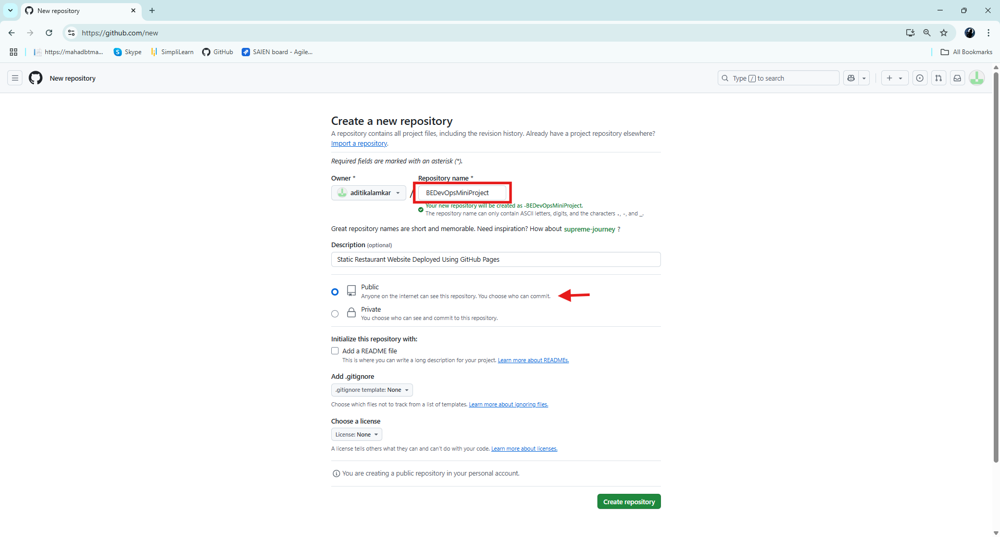
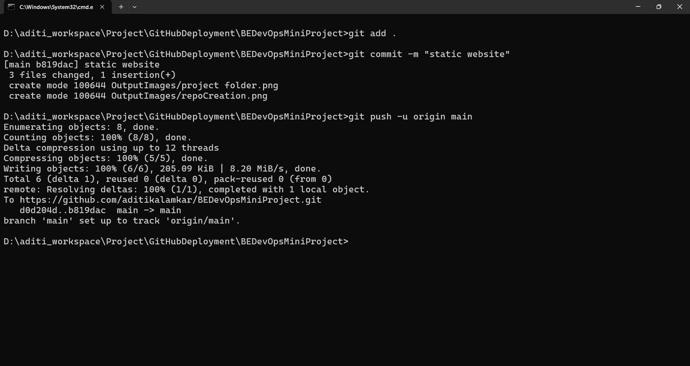
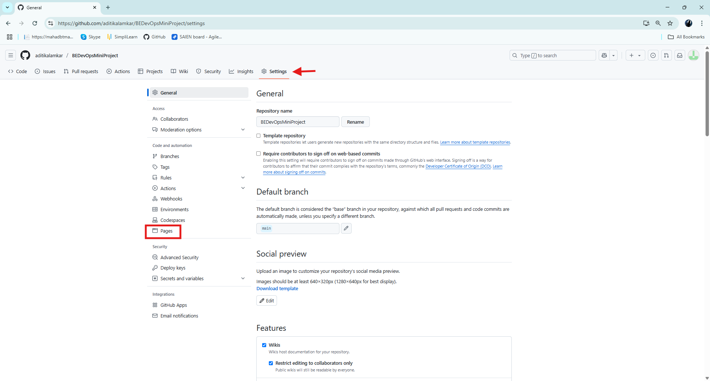
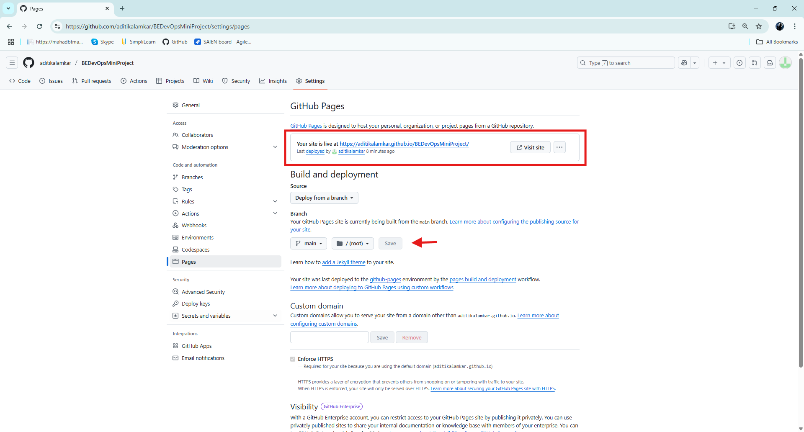
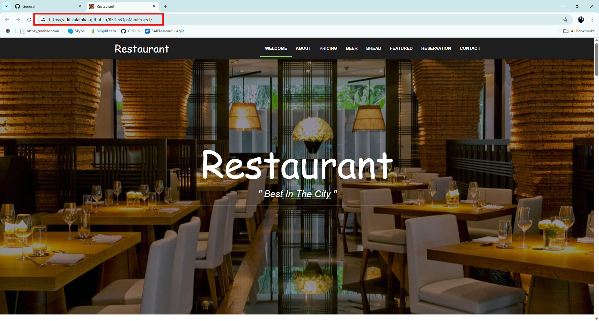

# 🍽️ Deployment of a Static Restaurant Website using GitHub Pages

---

## 📘 1. Introduction

This project focuses on the development and deployment of a **static restaurant website** using **GitHub Pages**.  
GitHub Pages is a free hosting service that allows you to publish web content directly from a GitHub repository.

---

## 🛠️ 2. Requirements

Before starting, ensure you have the following:

- 👤 A GitHub account  
- 🧠 Basic knowledge of HTML, CSS (and optionally JS)  
- 🖥️ Visual Studio Code or any code editor  
- 🔧 Git installed on your system  
- 🌐 Internet connection  

---

## 🚀 3. Step-by-Step Deployment Process

### ✅ Step 1: Create Your Website Locally

Develop your restaurant website using **HTML**, **CSS**, and optionally **JavaScript**.  
Make sure all files are in a single folder.
 


---

### ✅ Step 2: Create a GitHub Repository

1. Go to [GitHub](https://github.com) and log in.  
2. Click on **New Repository**.  
3. Name it something like `restaurant-website`.  
4. Keep it public and **do not initialize with README** (you'll push your files later).  




---

### ✅ Step 3: Push Your Code to GitHub

Open terminal or Git Bash in your project folder and run the following commands:

```bash
git init
git remote add origin https://github.com/your-username/restaurant-website.git
git add .
git commit -m "Initial commit"
git push -u origin main
```

 


---

### ✅ Step 4: Deploy via GitHub Pages

1. Go to your repository on GitHub.  
2. Click **Settings > Pages** (from the sidebar).  
3. Under **Source**, select the `main` or `master` branch and `/root` folder.  
4. Click **Save**.  
5. GitHub will generate a URL — this is your live website! 🌍





---

### ✅ Step 5: Access Your Website

- Visit the URL shown in the GitHub Pages section.  
- Example:  
  `https://your-username.github.io/restaurant-website/`  

🔗 Demo Link: [https://aditikalamkar.github.io/BEDevOpsMiniProject/](https://aditikalamkar.github.io/BEDevOpsMiniProject/)

  

---

## 🏁 4. Conclusion

Using **GitHub Pages** for hosting static websites is a **quick**, **reliable**, and **free** method.  
This project demonstrates how a restaurant website can be built and deployed effectively without any backend setup.

---
